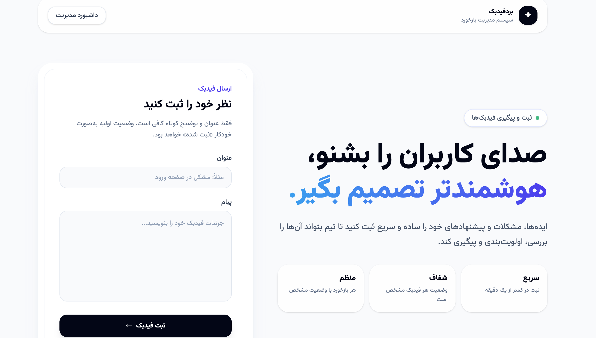
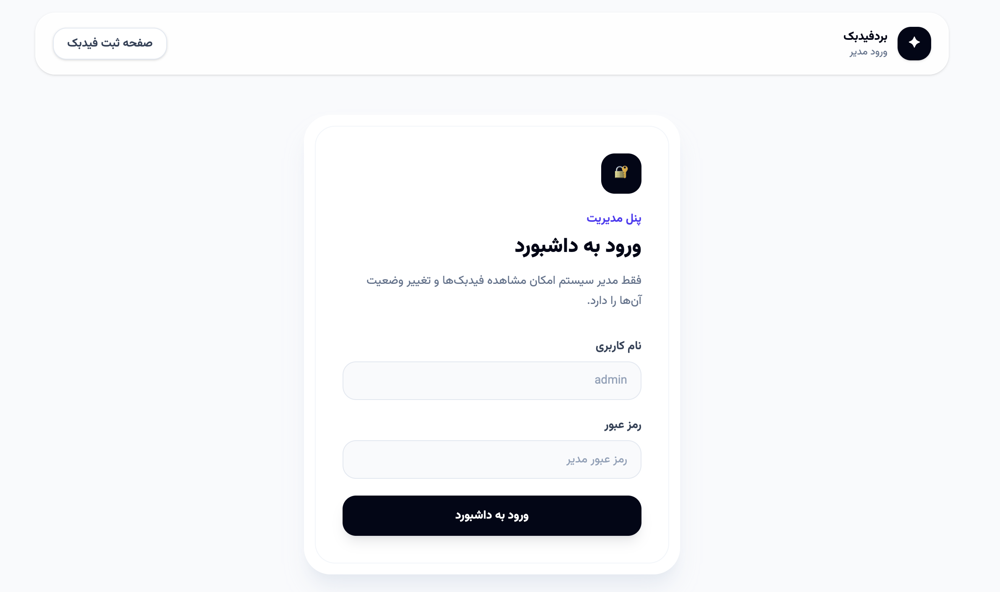
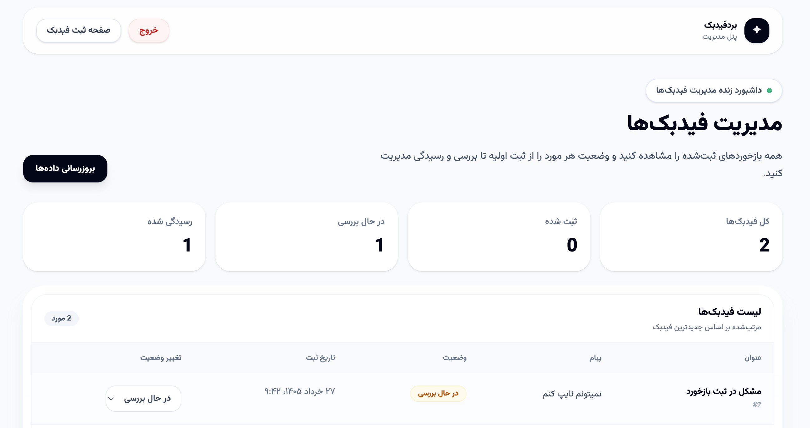

# Feedback Board

A simple, modern feedback management system built as an end-to-end fullstack project.

Users can submit feedback through a clean public form, and an admin can log in to view all submitted feedbacks and update their statuses.

## Features

* Submit feedback with title and message
* Default feedback status: `submitted`
* Admin login page
* Protected admin dashboard
* View all feedbacks in the dashboard
* Update feedback status:

  * `submitted`
  * `in_review`
  * `resolved`
* Summary cards for feedback statistics
* Responsive and modern UI
* REST API built with FastAPI
* SQLite database for simple local setup
* Docker support for easier deployment

## Tech Stack

### Backend

* Python
* FastAPI
* SQLAlchemy
* SQLite
* Pydantic

### Frontend

* Next.js
* TypeScript
* Tailwind CSS

### DevOps

* Docker
* Docker Compose

## Project Structure

```text
feedback-board/
├── backend/
│   ├── app/
│   │   ├── crud.py
│   │   ├── database.py
│   │   ├── main.py
│   │   ├── models.py
│   │   └── schemas.py
│   ├── Dockerfile
│   ├── requirements.txt
│   └── .env.example
├── frontend/
│   ├── app/
│   │   ├── admin/
│   │   ├── login/
│   │   ├── layout.tsx
│   │   └── page.tsx
│   ├── Dockerfile
│   └── package.json
├── screenshots/
├── docker-compose.yml
├── .env.example
└── README.md
```

## Screenshots

### Feedback Submission Page



### Admin Login Page



### Admin Dashboard



## Local Setup

### 1. Clone the repository

```bash
git clone <repository-url>
cd feedback-board
```

### 2. Backend setup

```bash
cd backend
python3 -m venv .venv
source .venv/bin/activate
pip install -r requirements.txt
```

Create a `.env` file inside the `backend` directory:

```env
DATABASE_URL=sqlite:///./feedback_board.db
FRONTEND_ORIGIN=http://localhost:3000

ADMIN_USERNAME=admin
ADMIN_PASSWORD=admin123
ADMIN_TOKEN=change-this-local-admin-token
```

Run the backend:

```bash
uvicorn app.main:app --reload
```

The backend will be available at:

```text
http://127.0.0.1:8000
```

Health check:

```bash
curl http://127.0.0.1:8000/health
```

### 3. Frontend setup

Open another terminal:

```bash
cd frontend
npm install
```

Create a `.env.local` file inside the `frontend` directory:

```env
NEXT_PUBLIC_API_URL=http://127.0.0.1:8000
```

Run the frontend:

```bash
npm run dev
```

The frontend will be available at:

```text
http://localhost:3000
```

## Admin Login

Default local admin credentials:

```text
username: admin
password: admin123
```

These values can be changed through environment variables.

## API Endpoints

### Health Check

```http
GET /health
```

### Submit Feedback

```http
POST /feedback
```

Request body:

```json
{
  "title": "Login issue",
  "message": "I cannot log in to my account."
}
```

### Admin Login

```http
POST /auth/login
```

Request body:

```json
{
  "username": "admin",
  "password": "admin123"
}
```

### List Feedbacks

Protected endpoint:

```http
GET /feedback
```

Required header:

```http
Authorization: Bearer <admin-token>
```

### Update Feedback Status

Protected endpoint:

```http
PATCH /feedback/{feedback_id}/status
```

Request body:

```json
{
  "status": "in_review"
}
```

Valid statuses:

```text
submitted
in_review
resolved
```

## Run with Docker

Create a `.env` file in the project root:

```env
NEXT_PUBLIC_API_URL=http://localhost:8000
FRONTEND_ORIGIN=http://localhost:3000

ADMIN_USERNAME=admin
ADMIN_PASSWORD=admin123
ADMIN_TOKEN=change-this-local-admin-token
```

Run the project:

```bash
docker compose up --build
```

Frontend:

```text
http://localhost:3000
```

Backend:

```text
http://localhost:8000
```

## Technical Decisions

### FastAPI for Backend

FastAPI was chosen because it is lightweight, fast to develop with, and provides automatic API documentation. It is a good fit for building a small but structured REST API.

### SQLAlchemy for Database Access

SQLAlchemy was used to keep database logic clean and separated from API routes. The current implementation uses SQLite for simplicity, but the project structure allows switching to PostgreSQL with minimal changes.

### SQLite for Local Development

SQLite was selected to make the project easy to run locally without requiring extra database setup. For a production environment, PostgreSQL would be a better choice.

### Next.js and Tailwind CSS for Frontend

Next.js was used for building a modern frontend structure, while Tailwind CSS helped create a clean, responsive, and minimal UI quickly.

### Simple Admin Authentication

A simple token-based admin login was implemented to protect the dashboard and status update actions. This keeps the project focused and avoids unnecessary complexity while still covering the basic access-control requirement.

### Avoiding Over-engineering

The goal was to build a functional end-to-end MVP within a limited time. For this reason, features like role management, email notifications, advanced filtering, and complex authentication flows were intentionally left out.

## Assumptions

* Public users can only submit feedback.
* Only the admin can view feedbacks and update their statuses.
* Feedback deletion is not included because the task focuses on registration, tracking, and status management.
* SQLite is enough for local review and simple deployment, but PostgreSQL can be used in a production setup.
* Admin credentials are managed through environment variables.

## Possible Improvements

* Add PostgreSQL for production deployment
* Add feedback filtering by status
* Add search in the admin dashboard
* Add pagination for large feedback lists
* Add created/updated timestamps in a more detailed view
* Add stronger authentication with JWT expiration
* Add tests for API endpoints

## Author

Built by Sara Ghazavi as an entry task for the Fullstack Builder Residency.
